# Game AI Final Project

## Introduction
CITM-UPC Game AI Final Project. This Project is a compilation of all work completed throughout the course. Project includes work with agent Pathfinding, Wandering, Camera Detection, Waypoints, Behavior Bricks, Flocking, and Formation Motion. 

## Controls and Menu Features
### Menu
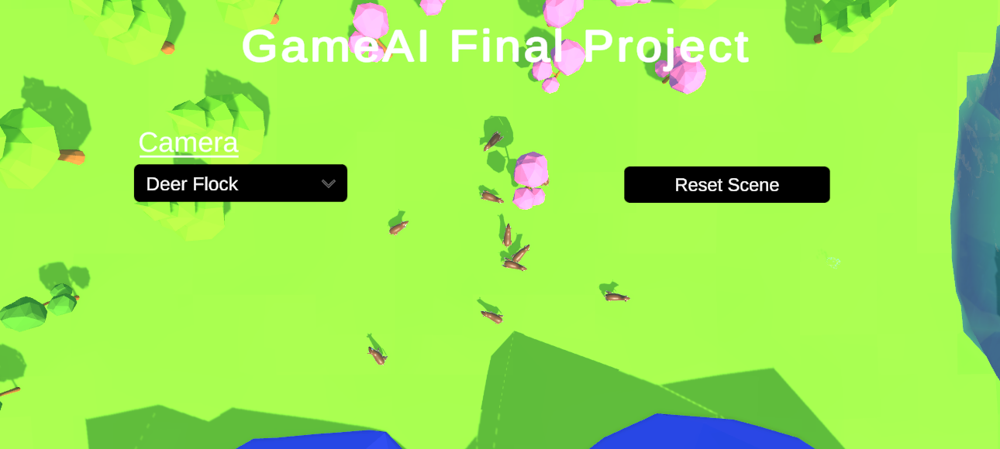

Press esc to open the Projects Menu system, which allows the user to navigate to various cameras illustrating AI behavior, and reset the scene. 

### Camera Selection

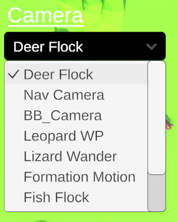

Open the Dropdown Menu to toggle between Camera's showing behaviors. 

### Restart Scene

Push the Restart Scene Button to Reset all Behavior

## AI Behaviors Featured
| Feature | Behavior Type | Information         | View in Scene                     | Implementation                    |
|--------------|---------------------|---------------------|--------------------------------|--------------------------------|
| Crocodile & Snake Behavior  | **Behavior Bricks** |The scene featues a Crocodile guarding his egg. The Crocodile can be moved via the user using mouse clicks. However be careful, a Snake is attempting to steal the egg, and if the Crocodile is moved too far the Snake will steal and subsequently hide.         | 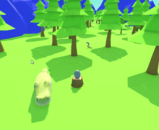 | 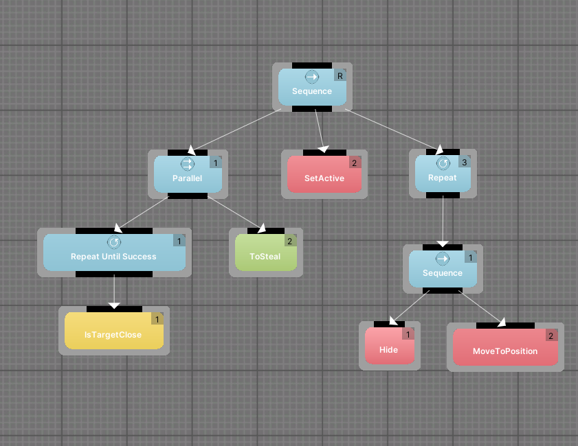 |
| Navigation Camera      | **None** | Navigatable Camera in Scene using user mouse positioning and WASD movement. Press shift or ctrl to rise or descend.       |  | [Navigation Camera](https://github.com/RylanJGraham/GameAI_FinalProject/blob/main/GameAI_FinalProject/Assets/Scripts/UI/CustomCameraController.cs) |
| Deer Behavior     | **Wander** | Deers flock within scene. The flock moves location around the entire scene and the deer with it. Flocking is random. Deer Manager has an adjustable amount of deer, and adjustable radius's, speed etc  |  | *[Deer Manager](https://github.com/RylanJGraham/GameAI_FinalProject/blob/main/GameAI_FinalProject/Assets/Scripts/Deer/DeerManager.cs)  *[Deer Controller](https://github.com/RylanJGraham/GameAI_FinalProject/blob/main/GameAI_FinalProject/Assets/Scripts/Deer/DeerController.cs)  |
| Wolf Behavior      | **Perception** | Wolves navigate scene randomly. Wolves have camera frustrum detection with adjustable range. If Wolves detect deer within camera they begin global pathing to detected deer location. Once close to deer they begin to pursue | 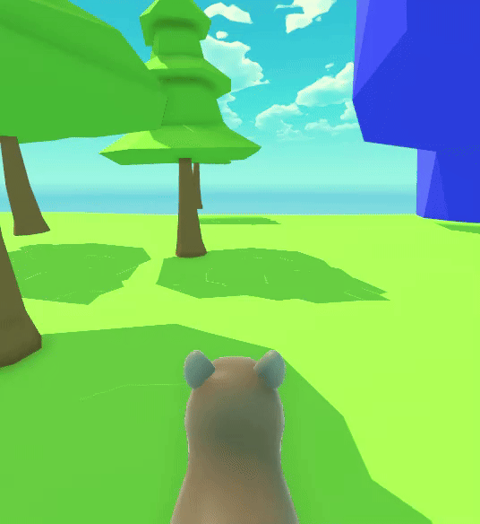 | *[Wolf Controller](https://github.com/RylanJGraham/GameAI_FinalProject/blob/main/GameAI_FinalProject/Assets/Scripts/Wolves/WolfController.cs)  *[Wolf Manager](https://github.com/RylanJGraham/GameAI_FinalProject/blob/main/GameAI_FinalProject/Assets/Scripts/Wolves/WolfManager.cs)  |
| Leopard Behavior     | **Waypoints** | Leopard navigates scene between waypoints. | 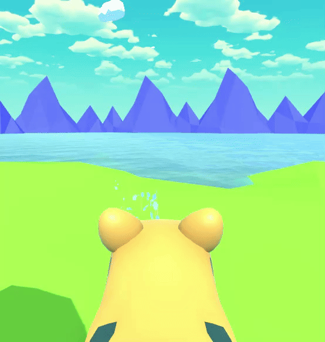 | *[Leopard Controller](https://github.com/RylanJGraham/GameAI_FinalProject/blob/main/GameAI_FinalProject/Assets/Scripts/Leopard/JaguarPatrol.cs) |
| Bird Flock Behavior     | **Flocking** | Birds spawn randomly across scene. They then begin moving to global flock position. Upon reaching position, birds begin to flock in a circle. | 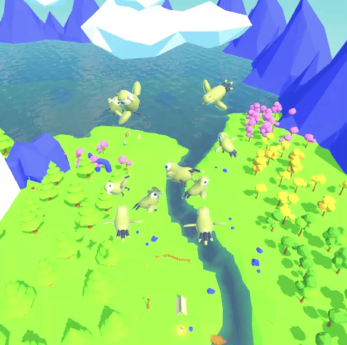 | *[Bird Controller](https://github.com/RylanJGraham/GameAI_FinalProject/blob/main/GameAI_FinalProject/Assets/Scripts/Birds/BirdFlocking.cs)  *[Bird Manager](https://github.com/RylanJGraham/GameAI_FinalProject/blob/main/GameAI_FinalProject/Assets/Scripts/Birds/BirdManager.cs)  |
| Fish Flock Behavior     | **Flocking** | Fish spawn around the scene. They then begin moving to the sunken treasure deep within the lake. Fish flock around the treasure. |  | *[Fish Controller](https://github.com/RylanJGraham/GameAI_FinalProject/blob/main/GameAI_FinalProject/Assets/Scripts/Fish/FishFlocking.cs)  *[Fish Manager](https://github.com/RylanJGraham/GameAI_FinalProject/blob/main/GameAI_FinalProject/Assets/Scripts/Fish/FishManager.cs)  |
| Formation Movement    | **Formation Movement** | An Otter leads Jerboa across the scene. Jerboa stay tight in formation behind the leader. The Otter has its movement controlled via player mouse clicks. Observe how the formation is kept, with spacing, and speed. | 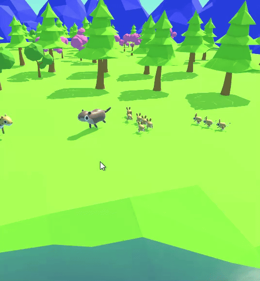 | *[Formation Movement](https://github.com/RylanJGraham/GameAI_FinalProject/blob/main/GameAI_FinalProject/Assets/Scripts/FormationMotion/Formation.css)  |
| Otter Behavior    | **Waypoints** | A group of Otters navigate the scene following the river. | 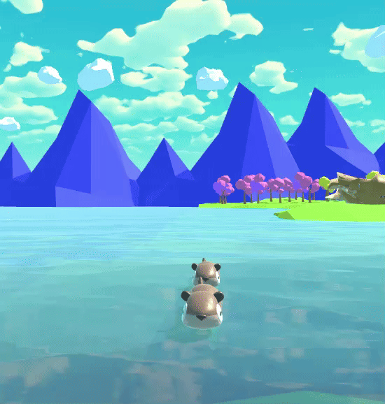 | *[Otter Controller](https://github.com/RylanJGraham/GameAI_FinalProject/blob/main/GameAI_FinalProject/Assets/Scripts/OtterMovement.cs) |
| Lizard Behavior    | **Wander** | group of Otters navigate the scene following the river. | 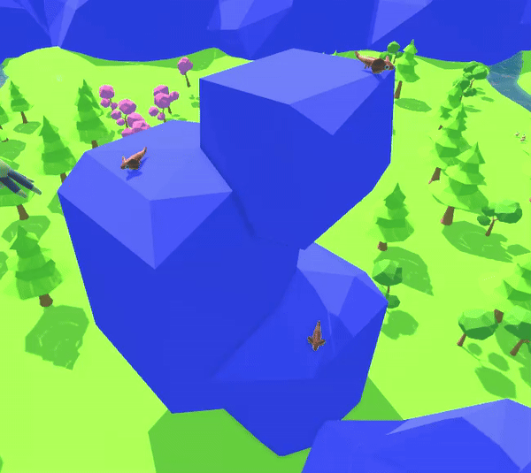 | *[Lizard Controller](https://github.com/RylanJGraham/GameAI_FinalProject/blob/main/GameAI_FinalProject/Assets/Scripts/Lizard/LizardWander.cs) |
| Villager Behavior    | **Wander** | A group of villagers gather around the campfire. Villagers stay within a flock radius and do not leave the area.|  | *[Villager Controller](https://github.com/RylanJGraham/GameAI_FinalProject/blob/main/GameAI_FinalProject/Assets/Scripts/Deer/DeerController.cs)  *[Vilager Manager](https://github.com/RylanJGraham/GameAI_FinalProject/blob/main/GameAI_FinalProject/Assets/Scripts/Deer/DeerManager.cs)  |

## Feature Demo Video (Click To Open)
[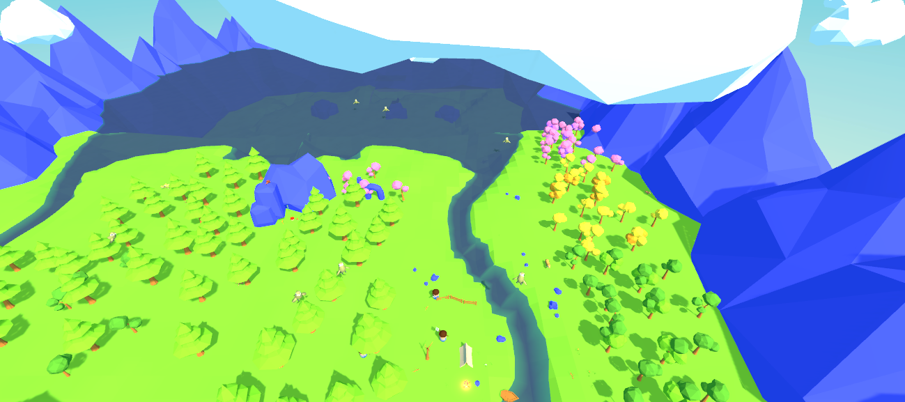](https://youtu.be/re5zXT0nyDQ?si=peYu1NAStD4Vv2tN)

## Developers

 - [Rylan Graham](https://github.com/RylanJGraham)

 
 - [Adrià Pons Mensa](https://github.com/AdriaPm)
